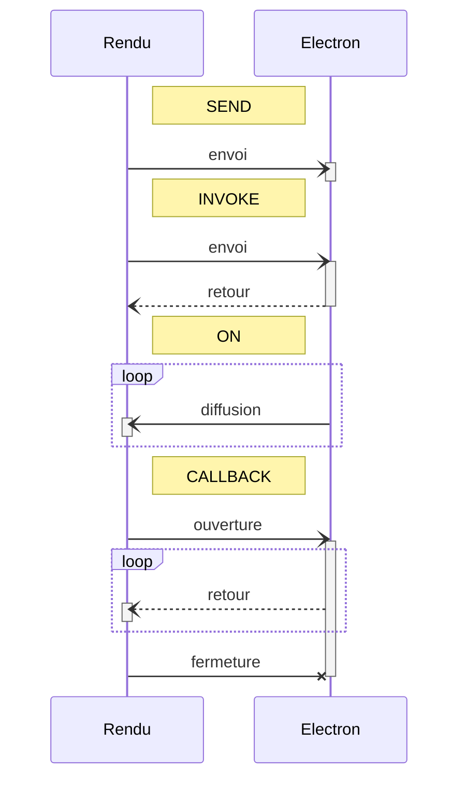
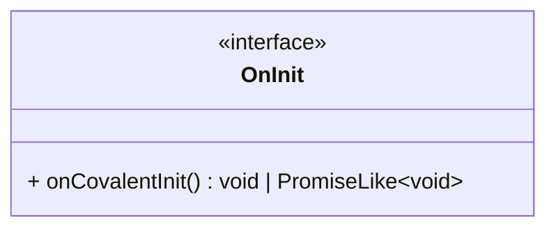

[](https://www.npmjs.com/package/@electron-covalent/common)
[](https://www.npmjs.com/package/@electron-covalent/core)
[](https://www.npmjs.com/package/@electron-covalent/render)
[](https://github.com/math-cheveux/covalent/actions/workflows/coverage.yml)

# Introduction

Covalent est une librairie TypeScript qui encapsule et facilite les communications inter-processus entre un back-end
Electron et un ou plusieurs front-end qu'Electron gère.
Cette librairie a été pensée pour des processus de rendu en Angular, mais il reste possible de l'utiliser dans d'autres
types de projets.

Dans Covalent, c'est Electron qui est maître. C'est donc lui qui expose sa logique aux processus de rendu.
Ce sont des classes, appelées _contrôleurs_, qui exposent leurs fonctionnalités.
Du côté des processus de rendu, chaque contrôleur est associé à une (voire plusieurs) classe, appelée _proxy_, qui fait
office de point d'accès aux fonctionnalités exposées par le contrôleur.
Les contrôleurs et les proxys qui leur sont associés partagent une interface commune, appelée _bridge_, qui définit les
fonctions exposées par le contrôleur.

## Types de communication

Covalent gère quatre types de communication inter-processus :

- `SEND` : Envoi d'une information depuis un processus de rendu vers le processus principal.
- `INVOKE` : Envoi d'une information depuis un processus de rendu vers le processus principal et attente d'une réponse.
- `ON` : Envoi d'une information depuis le processus principal vers tous les processus de rendu.
- `CALLBACK` : Envoi d'une information depuis un processus de rendu vers le processus principal et écoute d'un flux de
  retour.

Voici les diagrammes de séquences correspondants :



Puisqu'il s'agit de communications inter-processus, les appels sont tous asynchrones.

## Exemples

Dans les sections suivantes, les interfaces suivantes seront utilisées pour les exemples de code :

```typescript
import { Bridge } from "@electron-covalent/types";

export type ClickEvent = { buttons: number; x: number; y: number; ctrl: boolean };

// descriptions du point de vue d'un processus de rendu

export interface ExampleBridge {
  doAction: Bridge.Send<string>; // envoi d'un string
  getConfig: Bridge.Invoke<void, { url: string }>; // demande d'un objet
  calculate: Bridge.Invoke<{ x: number }, number>; // envoi d'un objet et réception d'un nombre
  onDate: Bridge.On<Date>; // écoute d'une date
  onClick: Bridge.On<ClickEvent>; // écoute d'un événement de clic
  watchMetrics: Bridge.Callback<{ period: number }, { percentCpuUsage: number }>; // envoi d'une période et écoute d'une statistique
}
```

# Utilisation côté Electron

## Installation

Pour installer Covalent dans votre projet Electron, entrez la commande suivante :

```shell
npm i @electron-covalent/core
```

## Définition

Pour définir un contrôleur, il suffit d'ajouter le décorateur `Controller` à une classe.

```typescript
import { interval, map, Subject } from "rxjs";
import { BridgeType, CallbackSubject, Controller } from "@electron-covalent/core";

@Controller<ExampleController, ExampleBridge>({
  group: "example",
  bridge: {
    doAction: BridgeType.SEND,
    getConfig: BridgeType.INVOKE,
    calculate: BridgeType.INVOKE,
    onDate: BridgeType.ON,
    onClick: BridgeType.ON,
    watchMetrics: BridgeType.CALLBACK,
  },
  handlers: (self) => ({
    doAction: self.doAction,
    getConfig: () => self.config,
    calculate: self.calculate,
    watchMetrics: self.startWatchingMetrics,
  }),
  triggers: (self) => ({
    onDate: interval(200).pipe(map(() => new Date())),
    onClick: self.clickSubject.asObservable(),
  })
})
export class ExampleController {
  constructor(private readonly anotherController: AnotherController /*...*/) {
  }

  private clickSubject = new Subject<ClickEvent>();

  private doAction(action: string) {
    // ...
  }

  public get config(): { url: string } {
    // ...
  }

  private calculate(params: { x: number }): number {
    // ...
  }

  public startWatchingMetrics(subject: CallbackSubject<{ percentCpuUsage: number }>, input: { period: number }) {
    // ...
  }
}
```

- `group` est l'identifiant unique du contrôleur.
- `bridge` identifie le type de chaque endpoint. Malgré le fait que c'est redondant avec la définition du bridge, cette
  étape n'est pas automatisée à cause des limitations du langage.
- `handlers` définit les méthodes à exécuter pour chaque endpoint de type `SEND`, `INVOKE` ou `CALLBACK`.
- `triggers` définit les observables RxJS qui déclencheront les envois sur les endpoints de type `ON`.

`handlers` et `triggers` sont des fonctions qui ont pour paramètre l'instance du contrôleur.
De plus, on peut noter que même les membres privés de la classe sont accessibles dans le décorateur.

Une classe de contrôleur peut définir un constructeur, mais ses arguments doivent correspondre à d'autres contrôleurs.
Leurs instances seront automatiquement injectées.

## Enregistrement

Dans le script de lancement d'Electron, il faut appeler la méthode `Controllers.register` avec tous les contrôleurs en
paramètre :

```typescript
Controllers.register(/*...*/ ExampleController /*...*/);
```

Cette méthode instancie les contrôleurs.
L'ordre des contrôleurs importe peu, car la méthode prend en compte les injections de dépendance.
S'il y a des contrôleurs qui implémentent l'interface `OnInit`, la méthode appelle aussi leur méthode `onCovalentInit`.



L'interface `OnInit` permet aux contrôleurs d'avoir une partie d'initialisation asynchrone (car un constructeur est
forcément synchrone).
Attention aux dépendances avec les autres contrôleurs dans la méthode `onCovalentInit` : les méthodes `onCovalentInit`
sont appelées en parallèle, il se peut donc qu'un contrôleur utilisé dans une de ces méthodes ne soit pas encore
totalement initialisé.
Pour cela, il faut utiliser la méthode `Controllers.waitInit` pour l'ordonnancement.

## Exposition

Dans le script de preload des processus de rendu, il faut appeler la méthode `Controllers.exposeBridge` avec tous les
contrôleurs en paramètre :

```typescript
Controllers.exposeBridge(/*...*/ ExampleController /*...*/);
```

# Utilisation côté rendu

## Installation

Pour installer Covalent dans votre projet frontend, entrez la commande suivante :

```shell
npm i @electron-covalent/render
```

## Définition

Pour définir un proxy, il faut d'abord créer une _factory_ de proxy avec `Proxies.createFactory`.
Une factory permet de créer les fonctions attachées à un bridge.
Les factories ont quatre méthodes, une pour chaque type de communication.

- `send` : crée une fonction attachée à un endpoint de type `SEND`
- `invoke` : crée une fonction attachée à un endpoint de type `INVOKE`
- `of` : crée un `Observable` attachée à un endpoint `ON`
- `open` : crée une fonction qui retourne une `Subscription` attachée au cycle de vie d'un `CALLBACK`

Les factories ont une cinquième méthode qui est une variante de `invoke`, `invoke.cache` : cette méthode garde en
mémoire les valeurs reçues si elle est appelée plusieurs fois.
`invoke.cache` accepte un second argument optionnel pour définir un comportement de réinitialisation, sinon il est
possible d'utiliser `Bridges.invalidateCache` (cf. `resetConfig`dans l'exemple) ou `Bridges.invalidateCaches` pour
réinitialiser le cache manuellement.
_Note_ : les valeurs mises en cache ne sont pas partagées entre plusieurs instances de l'application, et elles
sont effacées à la fin du programme.

En plus d'une factory, il est possible de créer un _builder_ de factory avec `Proxies.createDefaultFactoryBuilder` pour
définir un comportement par défaut si vous voulez que votre application puisse tourner en dehors d'un contexte Electron
(pour des tests par exemple).
Comme les factories, les builders ont quatre méthodes :

- `onSend`: définit le comportement par défaut d'une fonction `send`
- `onInvoke`: définit le comportement par défaut d'une fonction `invoke`
- `listenTo`: définit les données reçues par défaut par l'`Observable` retourné par `of`
- `watchTo`: définit les données reçues par défaut par l'abonné retourné par `open`

Les builders ont une cinquième méthode, la méthode `build` pour créer une factory associée.

Les méthodes `Proxies.createFactory` et `ProxyDefaultFactoryBuilder.build` demandent un paramètre. Il correspond à
l'identifiant unique du contrôleur auquel le proxy se rattache.

```typescript
import { BehaviorSubject, interval, map } from "rxjs";
import { Proxies } from "@electron-covalent/render";

// const BRIDGE = Proxies.createFactory<ExampleBridge>("example");
const BRIDGE = Proxies.createDefaultFactoryBuilder<ExampleBridge>()
  .onInvoke("getConfig", { url: "/" })
  .onInvoke("calculate", Number.NaN)
  .listenTo("onDate", interval(250).pipe(map(() => new Date())))
  .watchTo("watchMetrics", () => new BehaviorSubject({ percentCpuUsage: Number.NaN }))
  .build("example");

@Injectable() // Angular services decorator.
export class ExampleProxy {
  public readonly doAction = BRIDGE.send("doAction");
  public readonly getConfiguration = BRIDGE.invoke.cache("getConfig");
  public readonly calculate = BRIDGE.invoke("calculate");
  public readonly date$ = BRIDGE.on("onDate");
  public readonly click$ = BRIDGE.on("onClick");
  public readonly watch = BRIDGE.open("watchMetrics");

  // Si invoke.cache est utilisé pour getConfiguration.
  public resetConfig(): void {
    Bridges.invalidateCache(this.getConfiguration);
  }
}
```
