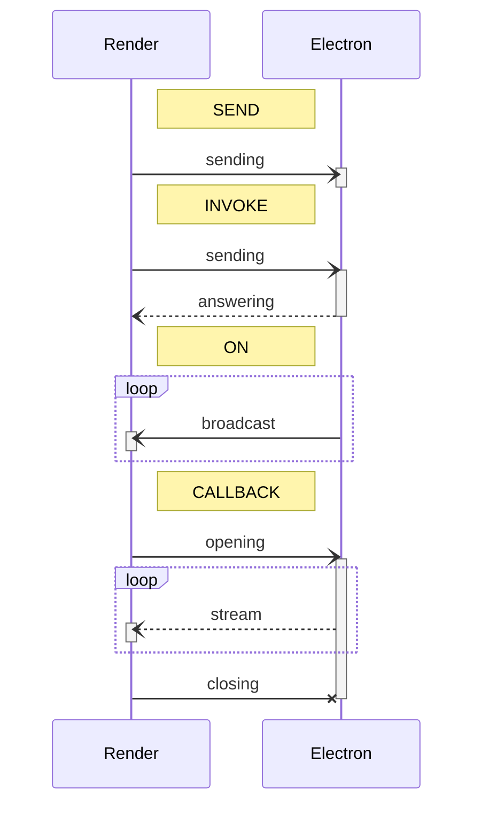
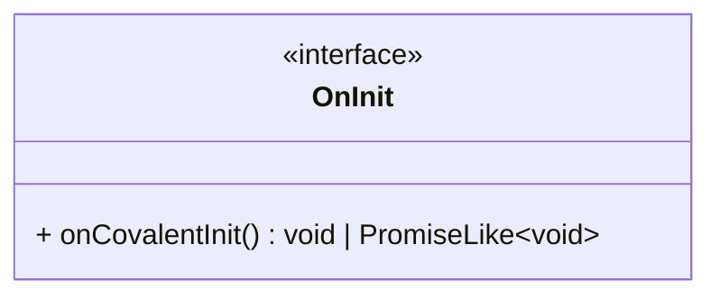

[](https://www.npmjs.com/package/@electron-covalent/common)
[](https://www.npmjs.com/package/@electron-covalent/core)
[](https://www.npmjs.com/package/@electron-covalent/render)
[](https://github.com/math-cheveux/covalent/actions/workflows/coverage.yml)

# Introduction

Covalent is a TypeScript library which encapsulates and facilitates inter-process communications between an Electron
backend and its frontends.
This library was thought for Angular render processes, but it can be used for other project types.

In Covalent, Electron is the master: the backend exposes its features to the render processes, the _controller_ classes
expose their functions.
On the render side, each controller is associated with one (or several) _proxy_ class to provide the controllers'
features to the front.
Controllers and their proxies share a _bridge_ interface that defines the functions exposed by controllers.

## Communication types

Covalent manages four types of inter-process communication:

- `SEND` : Sending data from a render process to the core process.
- `INVOKE` : Sending data from a render process to the core process and waiting for its answer.
- `ON` : Sending data from the core process to all the render processes.
- `CALLBACK` : Sending data from a render process to the core process and reading a stream.

Here are the corresponding sequence diagrams:



Since it is inter-process communication, all calls are asynchronous.

## Exemples

In the following sections, the following interfaces will be used in the example codes:

```typescript
import { Bridge } from "@electron-covalent/types";

export type ClickEvent = { buttons: number; x: number; y: number; ctrl: boolean };

// descriptions from the render process point of view

export interface ExampleBridge {
  doAction: Bridge.Send<string>; // sending a string
  getConfig: Bridge.Invoke<void, { url: string }>; // asking an object
  calculate: Bridge.Invoke<{ x: number }, number>; // sending an object and waiting for a number
  onDate: Bridge.On<Date>; // watching dates
  onClick: Bridge.On<ClickEvent>; // watching click events
  watchMetrics: Bridge.Callback<{ period: number }, { percentCpuUsage: number }>; // sending a period and watching stats
}
```

# Electron-side usage

## Installation

To install Covalent in your Electron project, run the following command:

```shell
npm i @electron-covalent/core
```

## Definition

To define a controller, just add the `Controller` decorator on a class.

```typescript
import { interval, map, Subject } from "rxjs";
import { BridgeType, CallbackSubject, Controller } from "@electron-covalent/core";

@Controller<ExampleController, ExampleBridge>({
  group: "example",
  bridge: {
    doAction: BridgeType.SEND,
    getConfig: BridgeType.INVOKE,
    calculate: BridgeType.INVOKE,
    onDate: BridgeType.ON,
    onClick: BridgeType.ON,
    watchMetrics: BridgeType.CALLBACK,
  },
  handlers: (self) => ({
    doAction: self.doAction,
    getConfig: () => self.config,
    calculate: self.calculate,
    watchMetrics: self.startWatchingMetrics,
  }),
  triggers: (self) => ({
    onDate: interval(200).pipe(map(() => new Date())),
    onClick: self.clickSubject.asObservable(),
  })
})
export class ExampleController {
  constructor(private readonly anotherController: AnotherController /*...*/) {
  }

  private clickSubject = new Subject<ClickEvent>();

  private doAction(action: string) {
    // ...
  }

  public get config(): { url: string } {
    // ...
  }

  private calculate(params: { x: number }): number {
    // ...
  }

  public startWatchingMetrics(subject: CallbackSubject<{ percentCpuUsage: number }>, input: { period: number }) {
    // ...
  }
}
```

- `group` is the unique ID of the controller.
- `bridge` identifies each endpoint type.
  Despite the fact that it is redundant with the bridge definition, this step can't be automatized because of the
  language limitations.
- `handlers` defines the methods to execute for each `SEND`, `INVOKE` and `CALLBACK` endpoints.
- `triggers` defines the RxJS observables that will trigger sending a message on `ON` endpoints.

`handlers` and `triggers` are functions with the controller instance as its parameter (controller private members are
reachable).

A controller class can define a constructor, but its arguments must be only other controllers.
Their instances will be injected automatically.

## Registering

In the Electron launching script, it is required to call the `Controllers.register` method with all the controllers as
its parameters:

```typescript
Controllers.register(/*...*/ ExampleController /*...*/);
```

This method instantiates the controllers.
The parameters order doesn't matter, since the method takes into account the dependency injections.
If there are controllers that implement the `OnInit` interface, this method will also call their `onCovalentInit`
method.



The `OnInit` interface allows controllers to have an asynchronous initialization part (since constructors are always
synchronous).
Be careful with dependencies between controllers with the `onCovalentInit`: `onCovalentInit` methods are called in
parallel, a controller can be not fully initialized when used inside it.
In this case, use the `Controllers.waitInit` method to assert controllers initialization.

## Exposition

In the preload script, it is required to call the method `Controllers.exposeBridge` with all the controllers as its
parameters:

```typescript
Controllers.exposeBridge(/*...*/ ExampleController /*...*/);
```

# Render-side usage

## Installation

To install Covalent in your frontend project, run the following command:

```shell
npm i @electron-covalent/render
```

## Definition

To define a proxy, you have to create a factory first with `Proxies.createFactory`.
A proxy factory creates the functions mapped to the bridge.
Factories have four methods, one for each type of communication:

- `send`: creates a function mapped to a `SEND` endpoint
- `invoke`: creates a function mapped to a `INVOKE` endpoint
- `of`: creates an `Observable` attached to a `ON` endpoint
- `open`: creates a function returning a `Subscription` attached to a `CALLBACK` lifecycle

Factories have a fifth method that is a variant of `invoke`, `invoke.cache`: this method will store the received
values if it is called multiple times.
`invoke.cache` accepts a second argument to define a reset behavior, otherwise, use `Bridges.invalidateCache` (cf.
`resetConfig` in the example) or `Bridges.invalidateCaches` to reset the cache manually.
_Note_: cached values are not shared between application instances, and they are deleted at the end of the
application.

On top of a proxy factory, you can create a factory builder with `Proxies.createDefaultFactoryBuilder` to define a
default behavior if you want your application to run outside Electron (for tests for example).
Same as factories, builders have four methods:

- `onSend`: defines the default behavior of a `send` function
- `onInvoke`: defines the default behavior of an `invoke` function
- `listenTo`: defines the data that the `of` `Observable` will receive by default
- `watchTo`: defines the data that the `open` subscriber will receive by default

Builders have a fifth method, the `build` method that will create a corresponding factory.

`Proxies.createFactory` and `ProxyDefaultFactoryBuilder.build` methods need one parameter. It corresponds to the
associated controller's unique ID.

```typescript
import { BehaviorSubject, interval, map } from "rxjs";
import { Proxies } from "@electron-covalent/render";

// const BRIDGE = Proxies.createFactory<ExampleBridge>("example");
const BRIDGE = Proxies.createDefaultFactoryBuilder<ExampleBridge>()
  .onInvoke("getConfig", { url: "/" })
  .onInvoke("calculate", Number.NaN)
  .listenTo("onDate", interval(250).pipe(map(() => new Date())))
  .watchTo("watchMetrics", () => new BehaviorSubject({ percentCpuUsage: Number.NaN }))
  .build("example");

@Injectable() // Angular services decorator.
export class ExampleProxy {
  public readonly doAction = BRIDGE.send("doAction");
  public readonly getConfiguration = BRIDGE.invoke.cache("getConfig");
  public readonly calculate = BRIDGE.invoke("calculate");
  public readonly date$ = BRIDGE.on("onDate");
  public readonly click$ = BRIDGE.on("onClick");
  public readonly watch = BRIDGE.open("watchMetrics");

  // If invoke.cache is used for getConfiguration.
  public resetConfig(): void {
    Bridges.invalidateCache(this.getConfiguration);
  }
}
```
